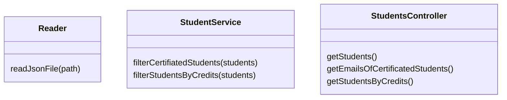
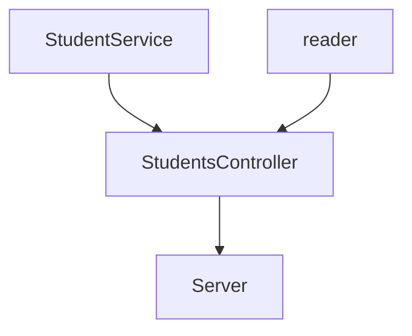

# CodeChallenge-LaunchX

## Cursos de Visual Thinking API

Aquí se encuentra la db en formato `JSON` de los estudiantes de Visual Partner-Ship.

> <a href="https://gist.github.com/carlogilmar/1f5164637fb77aecef3b9e6b9e2a9b63">visualpartners.json</a>

### Requerimientos

1. Habilitar un _endpoint_ para consultar los estudiantes con todos sus campos.
2. Habilitar un _endpoint_ para consultar los _emails_ de todos los estudiantes que tengan certificación `haveCertification` igual a `true`.
3. Habilitar un _endpoint_ para consultar todos los estudiantes que tengan `credits` mayor a $500$.

## Crear un nuevo proyecto

1. Crear las carpetas vacías llamadas `lib` y `test`.
2. Ejecutar el comando `npm init`, con este se ejecutará un cliente que nos preguntara algunos datos sobre el proyecto.

## Agregar dependencias

Para que nuestro proyecto funcione como nosotros queramos, necesitamos instalar las siguientes dependencias, con los siguientes comandos:

```console
~$ npm install --save-dev jest
~$ npm install eslint --save-dev
~$ npm install express --save
```

Debemos agregar las siguientes líneas al archivo `package.json`:

```json
  "scripts": {
    "test": "node ./node_modules/.bin/jest",
    "linter": "node ./node_modules/eslint/bin/eslint.js .",
    "linter-fix": "node ./node_modules/eslint/bin/eslint.js --fix .",
    "server": "node ./lib/server.js"
  }
```

Además, para configurar _linter_, el cual nos sirve para cuidar la legibilidad de nuestro código , hacemos lo siguiente:

1. Ejecutar el comando `npm init @eslint/config` y damos enter en todas las opciones por defecto, lo cual resultara en la creación de un archivo `.eslintrc.js`.
2. Agregamos la configuración correspondiente para que el archivo `.eslintrc.js` quede como:

```javascript
module.exports = {
    "env": {
        "browser": true,
        "commonjs": true,
        "es2021": true,
        "jest": true
    },
    "extends": "eslint:recommended",
    "parserOptions": {
        "ecmaVersion": "latest"
    },
    "rules": {
        indent: ["error", 4],
        "linebreak-style": ["error", "unix"],
        quotes: ["error", "double"],
        semi: ["error", "always"]
    }
};
```

## Automatizando _test_ mediante _GitHub Pages_

1. Crear el archivo `.github/workflows/test.yml` con el siguiente contenido:

    ```yaml
    name: Run Tests in my project every push on GitHub

    on: [push]

    jobs:
    build:
        runs-on: ubuntu-latest
        steps:
        - uses: actions/checkout@v1
        - name: Run Jest
        uses: stefanoeb/jest-action@1.0.3
    ```

## Implementado clases

Estas son las clases que debemos implementar para cumplir los requerimientos del proyecto.



De tal manera que el flujo del proyecto quede como:



## Requerimiento 1: Habilitar un _endpoint_ para consultar los estudiantes con todos sus campos

1. Creamos el archivo `lib/utils/reader.js`.
2. Creamos la clase `Reader`.
3. Creamos un método que regrese un arreglo de objetos con todos los estudiantes y sus atributos.  
    * Crear un método `static readJsonFile` que reciba como parámetro `path`.
    * Guardar la lógica para leer el archivo con la información y regresar la información de este.
    * Exportar la clase con _CommonJS_ como: `module.exports = Reader`.

Al final, el archivo debe quedar como:

```javascript
const fs = require("fs");

class Reader {
    static readJsonFile(filePath) {
        return JSON.parse(fs.readFileSync(filePath));
    }
}

module.exports = Reader;
```

## Requerimiento 2: Habilitar un _endpoint_ para consultar los _emails_ de todos los estudiantes que tengan certificación `haveCertification` igual a `true`

1. Creamos el arcvhio `lib/services/StudentService.js`.
2. Creamos la clase `StudentService`.
3. Creamos un método que regrese un arreglo con los _emails_ de los estudiantes que estén verificados.
    * Crear un método `static filterCertificatedStudents` que reciba como parámetro `students`.
    * Guardar la lógica para filtrar los estudiantes que tengan certificación `haveCertification` igual a `true`.
    * Exportar la clase con _CommonJS_ como: `module.exports = StudentService`.

    Al final, el código debe quedar como:

    ```javascript
    static filterCertificatedStudents(students) {
        const filterStudents = students.filter((student) => {
            if (student.haveCertification === true) {
                return student;
            }
        });
        const certificatedStudents = filterStudents.map((student) => {
            if (student.haveCertification === true) {
                return student.email;
            }
        });

        return certificatedStudents;
    }
    ```

## Requerimiento 3: Habilitar un _endpoint_ para consultar todos los estudiantes que tengan `credits` mayor a $500$

1. Creamos un método que regrese la información de los estudiantes que tengan `credits` mayor a $500$.
    * Crear un método `static filterStudentsByCredits` que reciba como parámetro `students`.
    * Guardar la lógica para filtrar los estudiantes que tengan `credits` mayor a $500$.  

    Al final, el código debe quedar como:

    ```javascript
    static filterStudentsByCredits (students) {
        const filterStudents = students.filter((student) => {
            if (student.credits > 500) {
                return student;
            }
        });

        return filterStudents;
    }
    ```

## Creando un _controller_ para conectar la funcionalidad con el servidor

1. Creamos el archivo `lib/controllers/StudentsController.js`.
2. Importamos la clase `Reader` y `StudentService`.
3. Creamos la clase `StudentsController` y la exportamos con _CommonJS_.
4. Crear un método que regrese un arreglo con todos los estudiantes y sus atributos.

    ```javascript
    static getStudents () {
        const students = Reader.readJsonFile("students.json");
        
        return students;
    }
    ```

5. Crear un método que regrese los _emails_ de los estudiantes con certificación.

    ```javascript
    static getEmailsOfCertificatedStudents () {
        const students = Reader.readJsonFile("students.json");
        const studentsEmails = StudentService.filterCertificatedStudents(students);

        return studentsEmails;
    }
    ```

6. Crear un método que regrese la información de los estudiantes con `credits` mayor a $500$.

    ```javascript
    static getStudentsByCredits () {
        const students = Reader.readJsonFile("students.json");
        const studentsByCredits = StudentService.filterStudentsByCredits(students);

        return studentsByCredits;
    }
    ```

## Creando un servidor básico con `express.js`

1. Crear un archivo `lib/server.js`.
2. Importar la clase `StudentsController`.
3. Crear el servidor.

    ```javascript
    const StudentsController = require("./../lib/controllers/StudentsController");

    const express = require("express");
    const app = express();
    const port = 3000;

    app.use(express.json());
    app.get("/", (request, response) => {
        response.json({"message": "Hello and welcome student!"});
    });

    app.listen(port, () => {
        console.log(`Server is running on port http://localhost:${port}`);   
    });
    ```
4. Ejecuta el servidor con `npm run server`.

### Creando _endpoints_ para el servidor

#### Creando _endpoint_ para consultar los estudiantes con todos sus campos

|          `Endpoint`          |                           `Response`                          |
|:----------------------------:|:-------------------------------------------------------------:|
| `localhost:3000/v1/students` | Se deberá obtener la lista de _students_ con todos sus campos |

El código debe quedar como:

```javascript
app.get("/v1/students", (request, response) => {
    const students = StudentsController.getStudents();

    response.json(students);
});
```

#### Creando _endpoint_ para consultar los _emails_ de todos los estudiantes que tengan certificación `haveCertification` igual a `true`

|          `Endpoint`          |                           `Response`                          |
|:----------------------------:|:-------------------------------------------------------------:|
| `localhost:3000/v1/students/emails` | Se deberá obtener la lista de _emails_ de los estudiantes que estén certificados|

El código debe quedar como:

```javascript
app.get("/v1/students/emails", (request, response) => {
    const studentsEmails = StudentsController.getEmailsOfCertificatedStudents();

    response.json(studentsEmails);
});
```

#### Creando un _endpoint_ para consultar la información de los estudiantes con `credits` mayor a $500$

|          `Endpoint`          |                           `Response`                          |
|:----------------------------:|:-------------------------------------------------------------:|
| `localhost:3000/v1/students/credits` | Se deberá obtener la lista de _students_ con todos sus campos cuyos `credits` sean mayor a $500$ |

El código debe quedar como:

```javascript
app.get("/v1/students/credits", (request, response) => {
    const studentsByCredits = StudentsController.getStudentsByCredits();

    response.json(studentsByCredits);
});
```

> **Autor:** Marcos López  
> **Programa:** Microsoft LaunchX
